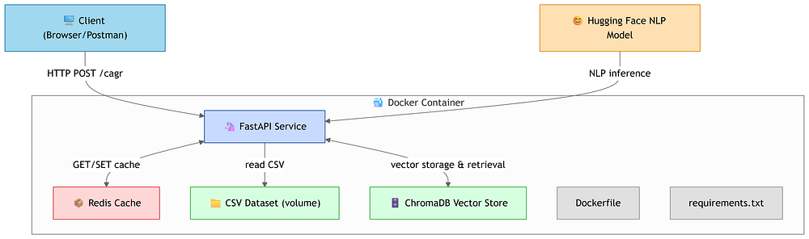

# CAG-Project

A FastAPI-based API to calculate Compound Annual Growth Rate (CAGR) from financial data. Uses Redis for caching, ChromaDB for vector storage, and Hugging Face models for NLP. Processes stock data from CSV files, computes CAGR over specified periods, and is Dockerized for easy deployment. Ideal for financial analytics.

## Key Features
- FastAPI endpoint for CAGR calculation
- Redis caching for performance
- ChromaDB for efficient data storage
- Hugging Face NLP integration
- Dockerized for portability

## Usage
- Clone repo
- Install dependencies with `requirements.txt`
- Build with `Dockerfile` and run
  

